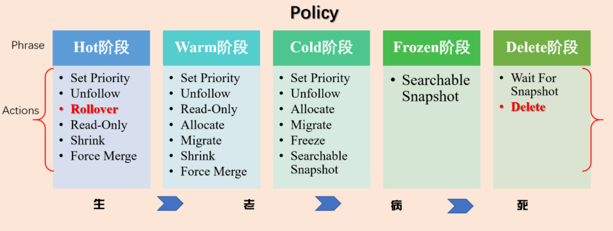
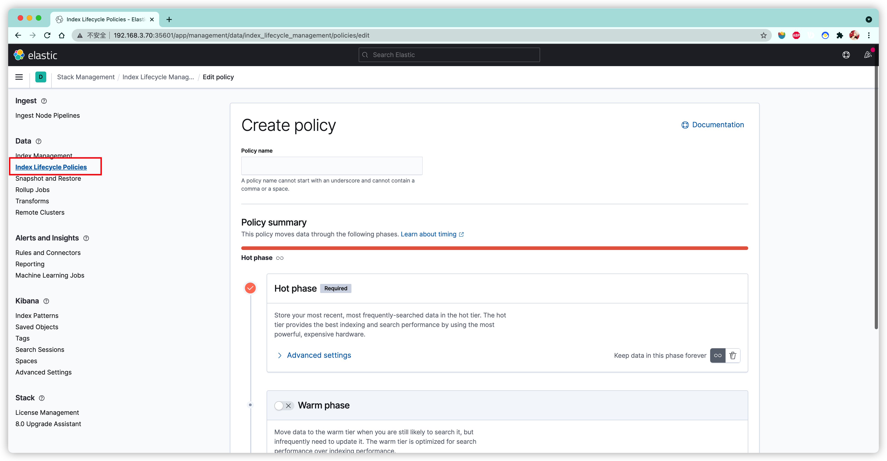
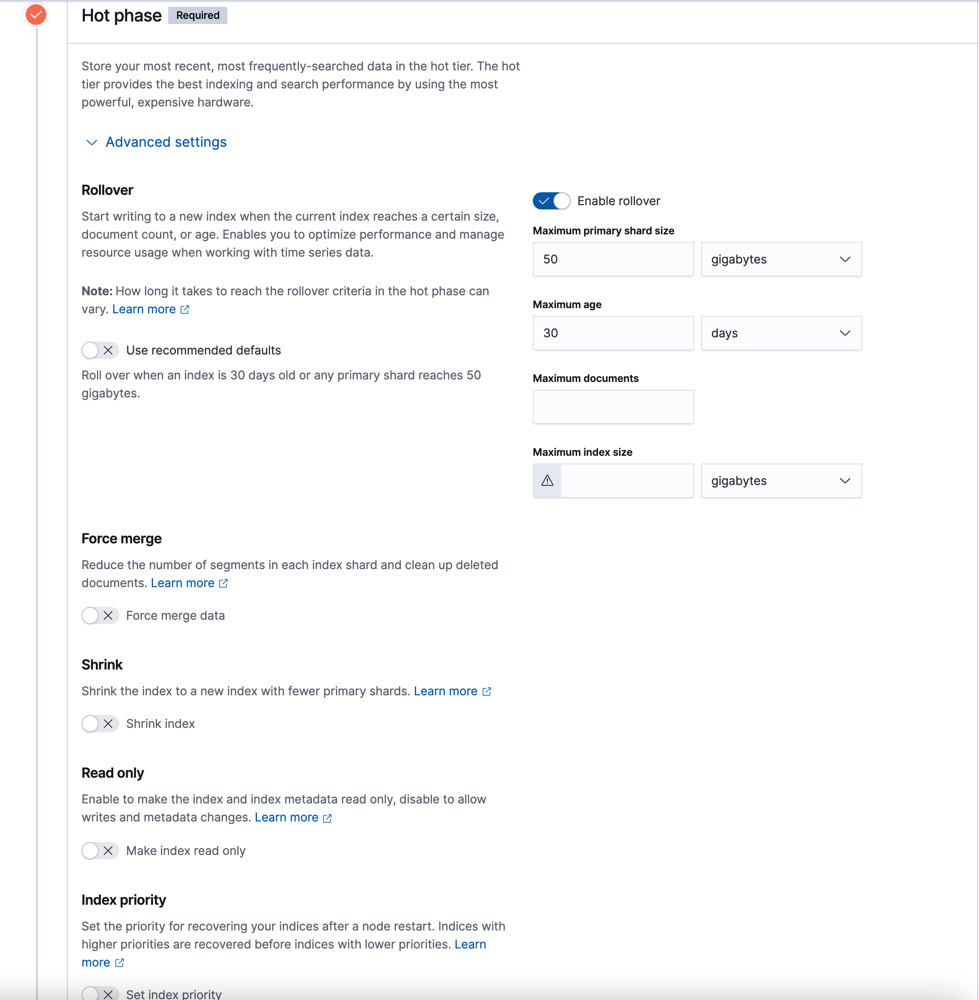
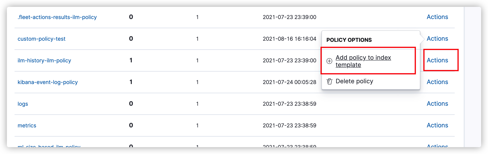
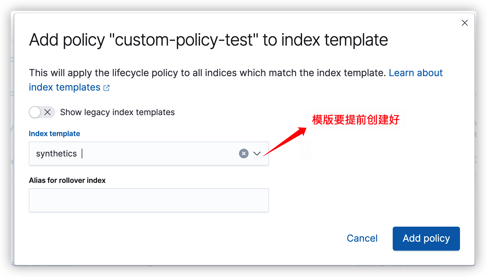

# Elasticsearch 学习文档

## 7.13 新特性

### 01.ILM索引生命周期

#### 1.什么是索引生命周期管理

​	索引创建后,内部结构基本上是相对静态的,数据会源源不断的导入到索引中,索引因为数据的不断导入而膨胀.这时就可能会导致一些问题:

- 索引过大如果出现健康问题,可能会导致整个集群不可用
- 索引过大恢复速度相对于较小的索引会明显变慢.
- 索引过大检索速度会明显变慢,写入更新速度也会受到影响
- 某些业务数据只关心最近一段时间的实时数据,索引中如果有较长时间数据,会对结果产生影响.
- 索引分片大小官方建议30G~50G,如果索引无限制增长则会超过这个数.


针对索引可能出现的问题,我们有必要对索引进行一系列的管理,使得索引能够在数据不断增长的情况下仍然满足我们的需求.

通过对索引进行管理,控制的操作和实现,就是索引生命周期管理.

#### 2.历史演变

Elasticsearch 6.6 引入,6.7版本正式推出.

Elasticsearch 6.6

- 官方Release Note:https://www.elastic.co/guide/en/elasticsearch/reference/6.8/release-notes-6.6.0.html
- 相关Pull Reuest: https://github.com/elastic/elasticsearch/pull/35193

Elasticsearch 6.7

- 官方Release Note:https://www.elastic.co/guide/en/elasticsearch/reference/6.8/release-notes-6.7.0.html

#### 3.实现索引生命周期的前提

- ##### 3.1 冷热集群架构

  冷热架构目的是给不同的节点设置不同的属性,让每个节点具有不同的属性

  配置冷热架构,配置项如下

  ```
  - node.attr.box_type: hot
  - node.attr.box_type: warm
  - node.attr.box_type: cold
  ```

  配置完成后,通过url 进行确认是否生效

  ```
  http://localhost:9200/_cat/nodeattrs
  ```


​	**热节点**:存放用户最关心的热数据

​	**温节点**:存放前一段时间存放的热数据,现在不再热了

​	**冷节点**:存放用户不太关心或者关心优先级低的冷数据,很久之前的热点数据等

​	

​	如果磁盘容量不足,冷数据是最先被删除的

​	如果硬件资源不足,热节点优先配置为SSD固态硬盘

​	检索优先级最高的是热节点的数据,基于热节点检索数据自然比基于全量数据响应时间要快.


- ##### 3.2 rollover 滚动索引

  Rollover API 解决以日期作为索引名称引起的索引大小不均衡的问题

  Rollover API 对于日志类数据非常有用,一般我们按天来对索引进行分割(数据量如果更大可以进一步拆分),没有Rollover 之前,需要在程序里设置一个自动生成索引对模版

  

  1.创建基于日期的索引 (使用kibana devtools)

```
  # 1、创建基于日期的索引
  PUT %3Cmy-index-%7Bnow%2Fd%7D-000001%3E
  {
    "aliases": {
      "my-alias": {
        "is_write_index": true
      }
    }
  }
```

​	2.批量导入数据

```
PUT my-alias/_bulk
{"index":{"_id":1}}
{"title":"testing 01"}
{"index":{"_id":2}}
{"title":"testing 02"}
{"index":{"_id":3}}
{"title":"testing 03"}
{"index":{"_id":4}}
{"title":"testing 04"}
{"index":{"_id":5}}
{"title":"testing 05"}
```

​	3.rollover 滚动索引

```
POST my-alias/_rollover
{
  "conditions": {
    "max_age": "7d",
    "max_docs": 5,
    "max_primary_shard_size": "50gb"
    # 7.6 版本使用"max_size": 50gb
  }
}

```

​	max_primary_shard_size 新参数,url https://github.com/elastic/elasticsearch/issues/63026


​	4.在满足滚动条件的前提下滚动索引

```
PUT my-alias/_bulk
{"index":{"_id":6}}
{"title":"testing 06"}
```

​	5.检索数据,验证滚动是否生效

```
GET my-alias/_search

结果如下

      {
        "_index" : "my-index-2021.08.16-000001",
        "_type" : "_doc",
        "_id" : "5",
        "_score" : 1.0,
        "_source" : {
          "title" : "testing 05"
        }
      },
      {
        "_index" : "my-index-2021.08.16-000002",
        "_type" : "_doc",
        "_id" : "6",
        "_score" : 1.0,
        "_source" : {
          "title" : "testing 06"
        }
      }
```

​	配置rollover 的几个重要参数

   **max_size**:"7d". 最长7天,超过七天索引会滚动

​	**"max_docs"**:5 .最大文档数,超过5个文档,索引会实现滚动

​	**"max_primary_Shard_size"**:"50gb", 主分片最大存储容量50GB,超过50GB,索引会滚动

​	三个条件之间是或大关系,满足其中一个,即可出发索引滚动


- ##### 3.3 shrink 压缩索引

  压缩索引的本质:在索引只读等三个条件下,减少索引的主分片数

  ```
  
  # 设置待压缩的索引，分片设置为5个。
  PUT kibana_sample_data_logs_ext
  {
    "settings": {
      "number_of_shards":5
    }
  }
  
  # 准备索引数据
  POST _reindex
  {
    "source":{
      "index":"kibana_sample_data_logs"
    },
    "dest":{
      "index":"kibana_sample_data_logs_ext"
    }
  }
  
  # shrink 压缩之前的三个必要条件
  PUT kibana_sample_data_logs_ext/_settings
  {
    "settings": {
      "index.number_of_replicas": 0,
      "index.routing.allocation.require._name": "node-024", 
      "index.blocks.write": true                                    
    }
  }
  
  # 实施压缩
  POST kibana_sample_data_logs_ext/_shrink/kibana_sample_data_logs_shrink
  {
    "settings": {
      "index.number_of_replicas": 0,
      "index.number_of_shards": 1, 
      "index.codec": "best_compression" 
    },
    "aliases": {
      "kibana_sample_data_logs_alias": {}
    }
  }
  
  ```

压缩的三个条件,缺一不可:

"Index.number_of_replicas":0 副本设置为0

"Index.routing.allocation.require._name":"yuuriso" 分片数据要求集中到一个独立的节点

"Index.blocks.write":true 索引设置只读


- ##### 3.4 Frozen 冷冻索引

  为了实现最高的检索性能,核心业务索引通常会都保存在内存中,这时内存使用率会变得很高

  对于一些业务非必需,非密集访问的某些索引,可以考虑释放内存,仅磁盘存储,必要时再还原检索

  这时,需要使用到Frozen 冷冻索引.除内存中维护其元数据,冻结索引在集群上几乎没有开销,而且冷冻索引是只读的.

```
# 冷冻索引
POST kibana_sample_data_logs_shrink/_freeze

# 冷冻后，不能写入
POST kibana_sample_data_logs_shrink/_doc/1
{
  "test":"12111"
}

# 冷冻后，能检索，但不返回具体数据，只返回0。
POST kibana_sample_data_logs_shrink/_search

# 解除冷冻
POST kibana_sample_data_logs_shrink/_unfreeze

# 解除冷冻后，可以检索和写入了
POST kibana_sample_data_logs_shrink/_search

```


冷热集群架构,冷热数据可以物理隔离

rollover 滚动索引,索引基于文档个数、时间、容量进行滚动升级,实现索引动态变化

shrink 索引,Frozen 冷冻索引,索引可以物理层面压缩,冷冻,释放内存空间和磁盘空间,提高集群可用性


除此之外,Force merge 段合并、Delete 索引数据删除,实现的索引的"生、老、病、死"全生命周期

单个指令操作比较繁琐,通过以下两种方式可以更为快捷

1.命令行DSL 综合实现

2.Kibana 图形化界面实现


#### 4.实战

- ##### 4.1不同阶段

  

- ##### 4.2各生命周期Actions 设定

  - 4.2.1 Hot阶段

  索引滚动升级(max_age=3、max_doc:5、max_size:50gb)

  设置优先级为:100

  - 4.2.2 Warm 阶段

  段合并

  副本设置为0

  数据迁移warm 节点

  优先级设置为50

  - 4.2.3 Cold 阶段

  冷冻索引

  索引迁移到冷节点

  - 4.2.4 Delete 阶段

  删除索引


触发滚动的条件:

Hot 阶段:手动创建第一个满足模版要求的索引

其余阶段: min_age,索引自创建后的时间

时间类似: 业务里面 热节点保留3天,温节点保留30天,冷节点保留30天


- 4.3 实战

  - 1.创建生命周期policy
  - 2.创建索引模版,模版关联policy 和别名
  - 3.创建符合模版的起始索引,并插入数据
  - 4.索引根据配置ilm 滚动

  实现DSL 如下

  ```
  # 前提:演示刷新需要
  PUT _cluster/settings
  {
    "persistent":{
      "indices.lifecycle.poll_interval":"1s"
    }
  }
  
  # 创建policy
  PUT _ilm/policy/my_custom_policy_filter
  {
    "policy":{
      "phases":{
        "hot":{
          "actions":{
            "rollover":{
              "max_age":"3d",
              "max_docs":5,
              "max_size":"50gb"
            },
            "set_priority":{
              "priority":100
            }
          }
        },
        "warm":{
          "min_age":"15s",
          "actions":{
            "forcemerge":{
              "max_num_segments":1
            },
            "allocate":{
              "require":{
                "box_type":"warm"
              },
              "number_of_replicas":0
            },
            "set_priority":{
              "priority":50
            }
          }
        },
        "cold":{
          "min_age":"30s",
          "actions":{
            "allocate":{
              "require":{
                "box_type":"cold"
              }
            },
            "freeze":{}
          }
        },
        "delete":{
          "min_age":"45s",
          "actions":{
            "delete":{}
          }
        }
      }
    }
  }
  
  
  # 定义模版,模版关联policy
  PUT _index_template/timeseries_template
  {
    "index_patterns":["timeseries-*"],
    "template":{
      "settings":{
        "number_of_shards":1,
        "number_of_replicas":0,
        "index.lifecycle.name":"my_custom_policy_filter",
        "index.lifecycle.rollover_alias":"timeseries",
        "index.routing.allocation.require.box_type": "hot"
      }
    }
  }
  
  # 创建起始索引,便于滚动
  PUT timeseries-00001
  {
    "aliases":{
      "timeseries":{
        "is_write_index": true
      }
    }
  }
  
  
  PUT timeseries/_bulk
  {"index":{"_id":1}}
  {"title":"testing 01"}
  {"index":{"_id":2}}
  {"title":"testing 02"}
  {"index":{"_id":3}}
  {"title":"testing 03"}
  {"index":{"_id":4}}
  {"title":"testing 04"}
  
  
  PUT timeseries/_bulk
  {"index":{"_id":5}}
  {"title":"testing 05"}
  
  PUT timeseries/_bulk
  {"index":{"_id":6}}
  {"title":"testing 06"}
  
  
  PUT timeseries/_bulk
  {"index":{"_id":7}}
  {"title":"testing 7"}
  ```

  

- 4.4 Kibana 图形化配置

1.选择Index Liftcycle Policy



2.分别配置Hot,Warm,Cold Phases.



3.关联模版 

需要手动创建模版

需要创建起始索引






实现ILM关键点在于配置Hot,Warm,Cold,Delete Phase,以及各个Phase 对应的Action

配置好policy, 创建模版,模版关联policy 与索引,即可将索引适应于policy

### 02.Elasticsearch 可搜索快照

### 03. Elasticsearch Data Stream

### 04.Elasticsearch 异步检索 Async Search

### 05. Kibana Data Visualizer 上传数据实战


## 01基础认知

### 0101.资料清单

###  0102.考点梳理

### 0103.基础概念梳理

### 0104.环境与数据

### 0105.考试答疑

### 0106.其他经验


## 02 考点串讲

### 0200.原理与考点梳理

### 0201.分词

### 0202.映射

### 0203.索引

### 0204.文档

### 0205.检索与聚合

### 0206.分片

### 0207.集群

### 0208.配置


## 03 难点解读


## 性能调优

### 1.通用性能调优

### 2.查询性能调优

### 3.写入性能调优


## 实战

### 1.指南

### 2.项目

