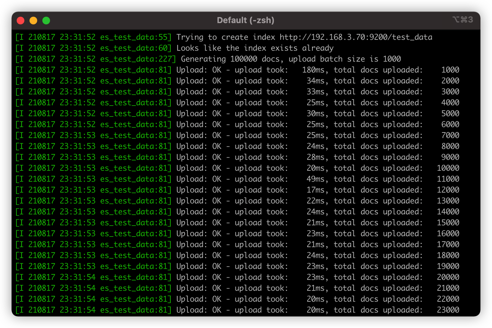
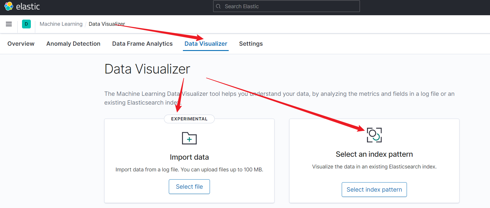
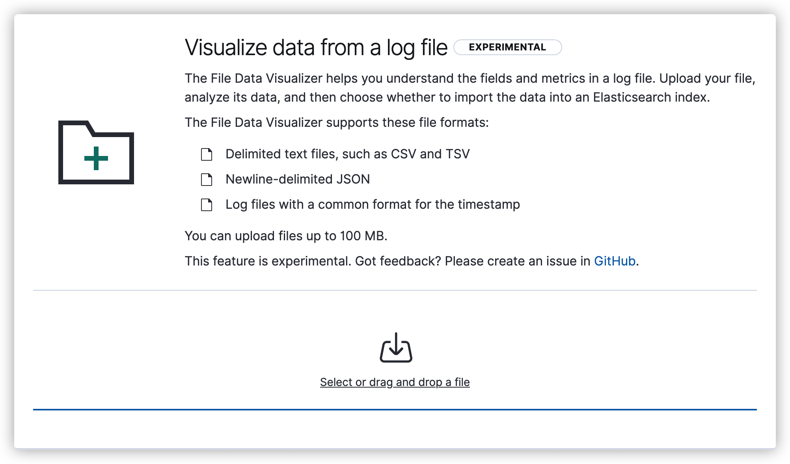
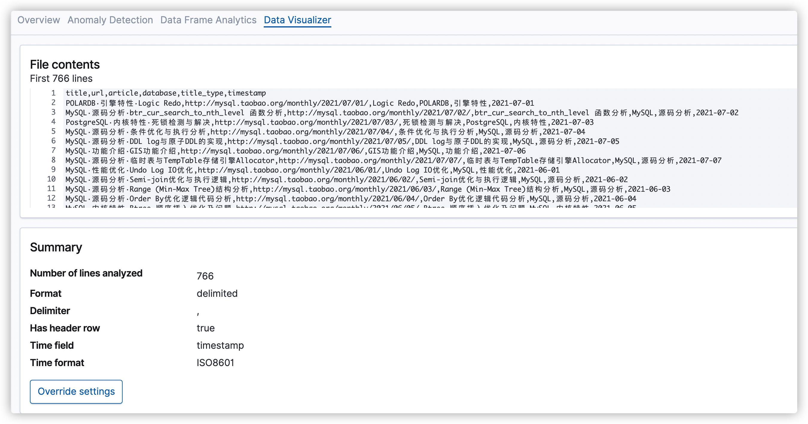
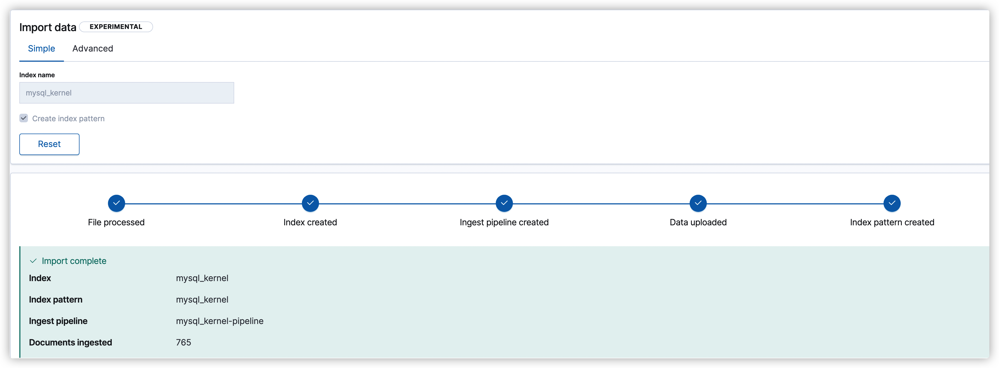

# Elasticsearch 学习文档

## 7.13 新特性

### 01.ILM索引生命周期

#### 1.什么是索引生命周期管理

​	索引创建后,内部结构基本上是相对静态的,数据会源源不断的导入到索引中,索引因为数据的不断导入而膨胀.这时就可能会导致一些问题:

- 索引过大如果出现健康问题,可能会导致整个集群不可用
- 索引过大恢复速度相对于较小的索引会明显变慢.
- 索引过大检索速度会明显变慢,写入更新速度也会受到影响
- 某些业务数据只关心最近一段时间的实时数据,索引中如果有较长时间数据,会对结果产生影响.
- 索引分片大小官方建议30G~50G,如果索引无限制增长则会超过这个数.


针对索引可能出现的问题,我们有必要对索引进行一系列的管理,使得索引能够在数据不断增长的情况下仍然满足我们的需求.

通过对索引进行管理,控制的操作和实现,就是索引生命周期管理.

#### 2.历史演变

Elasticsearch 6.6 引入,6.7版本正式推出.

Elasticsearch 6.6

- 官方Release Note:https://www.elastic.co/guide/en/elasticsearch/reference/6.8/release-notes-6.6.0.html
- 相关Pull Reuest: https://github.com/elastic/elasticsearch/pull/35193

Elasticsearch 6.7

- 官方Release Note:https://www.elastic.co/guide/en/elasticsearch/reference/6.8/release-notes-6.7.0.html

#### 3.实现索引生命周期的前提

- ##### 3.1 冷热集群架构

  冷热架构目的是给不同的节点设置不同的属性,让每个节点具有不同的属性

  配置冷热架构,配置项如下

  ```
  - node.attr.box_type: hot
  - node.attr.box_type: warm
  - node.attr.box_type: cold
  ```

  配置完成后,通过url 进行确认是否生效

  ```
  http://localhost:9200/_cat/nodeattrs
  ```


​	**热节点**:存放用户最关心的热数据

​	**温节点**:存放前一段时间存放的热数据,现在不再热了

​	**冷节点**:存放用户不太关心或者关心优先级低的冷数据,很久之前的热点数据等

​	

​	如果磁盘容量不足,冷数据是最先被删除的

​	如果硬件资源不足,热节点优先配置为SSD固态硬盘

​	检索优先级最高的是热节点的数据,基于热节点检索数据自然比基于全量数据响应时间要快.


- ##### 3.2 rollover 滚动索引

  Rollover API 解决以日期作为索引名称引起的索引大小不均衡的问题

  Rollover API 对于日志类数据非常有用,一般我们按天来对索引进行分割(数据量如果更大可以进一步拆分),没有Rollover 之前,需要在程序里设置一个自动生成索引对模版

  

  1.创建基于日期的索引 (使用kibana devtools)

```
  # 1、创建基于日期的索引
  PUT %3Cmy-index-%7Bnow%2Fd%7D-000001%3E
  {
    "aliases": {
      "my-alias": {
        "is_write_index": true
      }
    }
  }
```

​	2.批量导入数据

```
PUT my-alias/_bulk
{"index":{"_id":1}}
{"title":"testing 01"}
{"index":{"_id":2}}
{"title":"testing 02"}
{"index":{"_id":3}}
{"title":"testing 03"}
{"index":{"_id":4}}
{"title":"testing 04"}
{"index":{"_id":5}}
{"title":"testing 05"}
```

​	3.rollover 滚动索引

```
POST my-alias/_rollover
{
  "conditions": {
    "max_age": "7d",
    "max_docs": 5,
    "max_primary_shard_size": "50gb"
    # 7.6 版本使用"max_size": 50gb
  }
}

```

​	max_primary_shard_size 新参数,url https://github.com/elastic/elasticsearch/issues/63026


​	4.在满足滚动条件的前提下滚动索引

```
PUT my-alias/_bulk
{"index":{"_id":6}}
{"title":"testing 06"}
```

​	5.检索数据,验证滚动是否生效

```
GET my-alias/_search

结果如下

      {
        "_index" : "my-index-2021.08.16-000001",
        "_type" : "_doc",
        "_id" : "5",
        "_score" : 1.0,
        "_source" : {
          "title" : "testing 05"
        }
      },
      {
        "_index" : "my-index-2021.08.16-000002",
        "_type" : "_doc",
        "_id" : "6",
        "_score" : 1.0,
        "_source" : {
          "title" : "testing 06"
        }
      }
```

​	配置rollover 的几个重要参数

   **max_size**:"7d". 最长7天,超过七天索引会滚动

​	**"max_docs"**:5 .最大文档数,超过5个文档,索引会实现滚动

​	**"max_primary_Shard_size"**:"50gb", 主分片最大存储容量50GB,超过50GB,索引会滚动

​	三个条件之间是或大关系,满足其中一个,即可出发索引滚动


- ##### 3.3 shrink 压缩索引

  压缩索引的本质:在索引只读等三个条件下,减少索引的主分片数

  ```
  
  # 设置待压缩的索引，分片设置为5个。
  PUT kibana_sample_data_logs_ext
  {
    "settings": {
      "number_of_shards":5
    }
  }
  
  # 准备索引数据
  POST _reindex
  {
    "source":{
      "index":"kibana_sample_data_logs"
    },
    "dest":{
      "index":"kibana_sample_data_logs_ext"
    }
  }
  
  # shrink 压缩之前的三个必要条件
  PUT kibana_sample_data_logs_ext/_settings
  {
    "settings": {
      "index.number_of_replicas": 0,
      "index.routing.allocation.require._name": "node-024", 
      "index.blocks.write": true                                    
    }
  }
  
  # 实施压缩
  POST kibana_sample_data_logs_ext/_shrink/kibana_sample_data_logs_shrink
  {
    "settings": {
      "index.number_of_replicas": 0,
      "index.number_of_shards": 1, 
      "index.codec": "best_compression" 
    },
    "aliases": {
      "kibana_sample_data_logs_alias": {}
    }
  }
  
  ```

压缩的三个条件,缺一不可:

"Index.number_of_replicas":0 副本设置为0

"Index.routing.allocation.require._name":"yuuriso" 分片数据要求集中到一个独立的节点

"Index.blocks.write":true 索引设置只读


- ##### 3.4 Frozen 冷冻索引

  为了实现最高的检索性能,核心业务索引通常会都保存在内存中,这时内存使用率会变得很高

  对于一些业务非必需,非密集访问的某些索引,可以考虑释放内存,仅磁盘存储,必要时再还原检索

  这时,需要使用到Frozen 冷冻索引.除内存中维护其元数据,冻结索引在集群上几乎没有开销,而且冷冻索引是只读的.

```
# 冷冻索引
POST kibana_sample_data_logs_shrink/_freeze

# 冷冻后，不能写入
POST kibana_sample_data_logs_shrink/_doc/1
{
  "test":"12111"
}

# 冷冻后，能检索，但不返回具体数据，只返回0。
POST kibana_sample_data_logs_shrink/_search

# 解除冷冻
POST kibana_sample_data_logs_shrink/_unfreeze

# 解除冷冻后，可以检索和写入了
POST kibana_sample_data_logs_shrink/_search

```


冷热集群架构,冷热数据可以物理隔离

rollover 滚动索引,索引基于文档个数、时间、容量进行滚动升级,实现索引动态变化

shrink 索引,Frozen 冷冻索引,索引可以物理层面压缩,冷冻,释放内存空间和磁盘空间,提高集群可用性


除此之外,Force merge 段合并、Delete 索引数据删除,实现的索引的"生、老、病、死"全生命周期

单个指令操作比较繁琐,通过以下两种方式可以更为快捷

1.命令行DSL 综合实现

2.Kibana 图形化界面实现


#### 4.实战

- ##### 4.1不同阶段

  

- ##### 4.2各生命周期Actions 设定

  - 4.2.1 Hot阶段

  索引滚动升级(max_age=3、max_doc:5、max_size:50gb)

  设置优先级为:100

  - 4.2.2 Warm 阶段

  段合并

  副本设置为0

  数据迁移warm 节点

  优先级设置为50

  - 4.2.3 Cold 阶段

  冷冻索引

  索引迁移到冷节点

  - 4.2.4 Delete 阶段

  删除索引


触发滚动的条件:

Hot 阶段:手动创建第一个满足模版要求的索引

其余阶段: min_age,索引自创建后的时间

时间类似: 业务里面 热节点保留3天,温节点保留30天,冷节点保留30天


- 4.3 实战

  - 1.创建生命周期policy
  - 2.创建索引模版,模版关联policy 和别名
  - 3.创建符合模版的起始索引,并插入数据
  - 4.索引根据配置ilm 滚动

  实现DSL 如下

  ```
  # 前提:演示刷新需要
  PUT _cluster/settings
  {
    "persistent":{
      "indices.lifecycle.poll_interval":"1s"
    }
  }
  
  # 创建policy
  PUT _ilm/policy/my_custom_policy_filter
  {
    "policy":{
      "phases":{
        "hot":{
          "actions":{
            "rollover":{
              "max_age":"3d",
              "max_docs":5,
              "max_size":"50gb"
            },
            "set_priority":{
              "priority":100
            }
          }
        },
        "warm":{
          "min_age":"15s",
          "actions":{
            "forcemerge":{
              "max_num_segments":1
            },
            "allocate":{
              "require":{
                "box_type":"warm"
              },
              "number_of_replicas":0
            },
            "set_priority":{
              "priority":50
            }
          }
        },
        "cold":{
          "min_age":"30s",
          "actions":{
            "allocate":{
              "require":{
                "box_type":"cold"
              }
            },
            "freeze":{}
          }
        },
        "delete":{
          "min_age":"45s",
          "actions":{
            "delete":{}
          }
        }
      }
    }
  }
  
  
  # 定义模版,模版关联policy
  PUT _index_template/timeseries_template
  {
    "index_patterns":["timeseries-*"],
    "template":{
      "settings":{
        "number_of_shards":1,
        "number_of_replicas":0,
        "index.lifecycle.name":"my_custom_policy_filter",
        "index.lifecycle.rollover_alias":"timeseries",
        "index.routing.allocation.require.box_type": "hot"
      }
    }
  }
  
  # 创建起始索引,便于滚动
  PUT timeseries-00001
  {
    "aliases":{
      "timeseries":{
        "is_write_index": true
      }
    }
  }
  
  
  PUT timeseries/_bulk
  {"index":{"_id":1}}
  {"title":"testing 01"}
  {"index":{"_id":2}}
  {"title":"testing 02"}
  {"index":{"_id":3}}
  {"title":"testing 03"}
  {"index":{"_id":4}}
  {"title":"testing 04"}
  
  
  PUT timeseries/_bulk
  {"index":{"_id":5}}
  {"title":"testing 05"}
  
  PUT timeseries/_bulk
  {"index":{"_id":6}}
  {"title":"testing 06"}
  
  
  PUT timeseries/_bulk
  {"index":{"_id":7}}
  {"title":"testing 7"}
  ```

  

- 4.4 Kibana 图形化配置

1.选择Index Liftcycle Policy


2.分别配置Hot,Warm,Cold Phases.


3.关联模版 

需要手动创建模版

需要创建起始索引


实现ILM关键点在于配置Hot,Warm,Cold,Delete Phase,以及各个Phase 对应的Action

配置好policy, 创建模版,模版关联policy 与索引,即可将索引适应于policy

### 02.Elasticsearch 可搜索快照

可搜索快照为企业版功能,暂时跳过

### 03. Elasticsearch Data Stream

####  1.Data Stream 适合什么样的数据,什么样的场景

Data Stream 主要适合时序性数据,数据极少更新或者没有更新

#### 2.Data Stream 特点

- 关联后备支撑索引(backing indices)

data stream 实际是需要创建一系列的后备索引,data stream 是构建在后备索引之上的一层抽象

- @timestamp 字段不可缺少

每个写入到data stream 中的数据必须包含@timestamp 这个字段

而且@timestamp 字段必须是date 类型(如果不指定,默认为date 类型)或者data_nanos 类型


- data stream 后备索引规范

  创建后备索引,索引需要符合以下的约定命名

  ```
  .ds-<data-stream>-<yyyy.MM.dd>-<generation>
  ```

  来看一个实际的例子: .ds-data-streamm-2021.07.25-000001

  - .ds: 前缀开头
  - data-stream: 自定义的数据流名称
  - yyyy.MM.dd 日期格式
  - generaion: rollover 累计值 默认从0开始

- Append-only 仅追加

  在data stream 中仅追加指仅支持 op_type=create 的索引请求,含义是仅支持向后追加数据

  数据流只支持 update_by_query 以及 delete_by_query 实现批量操作.单条文档的更新和删除需要通过指定后备索引的方式实现

  因此对于一些需要频繁更新或者删除的数据 data stream 并不适合.使用模版+别名+ILM 会是一个更合适的选择.


#### 3.data stream 能做什么

- 支持直接的写入、查询请求
- 会自动将客户端请求路由到关联的索引,以存储流式数据
- 可以使用索引生命周期管理ILM 自动管理这些关联索引

#### 4.data stream 与索引有什么异同

**相同点**:

​	命令基本一致

**不同点**:

- 相比较于索引,data stream 多了一个抽象层,核心数据存储在以.ds 开头的后备索引中

- 有一些data stream 特有的操作:

  - data stream 必须包含@timestamp 字段

  - 删除和更新操作只支持update_by_query 、delete_by_query 这两种操作

  - 不能基于.ds 前缀的后备索引创建文档,但可以基于.ds 后备索引进行更新和删除操作.因此如果想要插入数据只能向创建后data stream进行插入.

    如果执意要在.ds 后备索引中插入,会返回如下错误

    ```
    "reason" : "index request with op_type=index and no if_primary_term and if_seq_no set targeting backing indices is disallowed, target corresponding data stream [my-data-stream] instead"
    ```

  - 后备索引无法进行:clone.close,delete,freeze,shrink和split 操作

#### 5.data stream 与模版的关系

一个模版可以支持多个data stream 是一对多的关系

模版和data stream 之间没有强约束, 不能通过删除data stream 的方式删除模版

#### 6.data stream 与ilm 关系

data stream 可以使用ilm 像管理索引一样管理data stream

data stream 操作时序数据有一个明显的优势,不需要再为ilm 配置index.lifecycle.rollover_alias


#### 7. 实际操作

主要涉及data stream 的创建,删除,修改,查询


##### 7.1 data stream 创建

1.创建生命周期policy,policy包含了热,暖,冷,冷冻,删除等阶段

```
PUT ilm/policy/my-lifecycle-policy
{
  "policy":{
    "phases":{
      "hot":{
        "actions":{
          "rollover":{
            "max_primary_shard_size":"50gb"
          }
        }
      },
      "warm":{
        "min_age":"30d",
        "actions":{
          "shrink":{
            "number_of_shards":1
          },
          "forcemerge":{
            "max_num_segements":1
          }
        }
      },
      "cold":{
        "min_age":"60d",
        "actions":{
          "searchable_snapshot":{
            "snapshot_repository":"found-snapshot"
          }
        }
      },
      "frozen":{
        "min_age":"90d",
        "actions":{
          "searchable_snapshot":{
            "snapshot_repository":"found-snapshot"
          }
        }
      },
      "delete":{
        "min_ahhe":"735d",
        "actions":{
          "delete":{}
        }
      }
    }
  }
}
```

执行命令后返回结果

```
{
  "_index" : "ilm",
  "_type" : "policy",
  "_id" : "my-lifecycle-policy",
  "_version" : 1,
  "result" : "created",
  "_shards" : {
    "total" : 2,
    "successful" : 1,
    "failed" : 0
  },
  "_seq_no" : 0,
  "_primary_term" : 1
}

```

2.创建模版

```
PUT _component_template/my-mapping
{
  "template":{
    "mappings":{
      "properties":{
        "@timestamp":{
          "type":"date",
          "format":"date_optional_time||epoch_millis"
        },
        "message":{
          "type":"wildcard"
        }
      }
    }
  }
}
```

执行后返回结果

```
{
  "acknowledged" : true
}
```


```
# Creates a component template for index settings
PUT _component_template/my-settings
{
  "template":{
    "settings":{
      "index.lifecycle.name":"my-liftcycle-policy"
    }
  }
}


PUT _index_template/my-index-template
{
  "index_patterns":["my-data-stream*"],
  "data_stream":{ },
  "composed_of":["my-mapping","my-settings"],
  "priority":500
}
```

3.创建data stream

两种方式

- 直接创建数据流 my-data-stream

PUT _data_stream/my-data-stream

- 直接批量或者逐个导入数据(会间接生成 data stream 的创建)


```

PUT my-data-stream/_bulk
{"create":{ }}
{ "@timestamp": "2099-05-06T16:21:15.000Z", "message": "192.0.2.42 - - [06/May/2099:16:21:15 +0000] \"GET /images/bg.jpg HTTP/1.0\" 200 24736" }
{ "create":{ } }
{ "@timestamp": "2099-05-06T16:25:42.000Z", "message": "192.0.2.255 - - [06/May/2099:16:25:42 +0000] \"GET /favicon.ico HTTP/1.0\" 200 3638" }


POST my-data-stream/_doc
{
  "@timestamp": "2099-05-06T16:21:15.000Z",
  "message": "192.0.2.42 - - [06/May/2099:16:21:15 +0000] \"GET /images/bg.jpg HTTP/1.0\" 200 24736"
}
```

注意点:

- 批量bulk操作,必须使用create 指令,而非index(使用index 不会报错,但是会把stream 当做index 处理)
- 文档必须包含@timestamp字段


##### 7.2 data sream 删除

删除数据流

```
DELETE _data_stream/my-data-stream
```

单条文档删除

```
DELETE .ds-my-data-stream-2021.08.17-000001/_doc/1
```

批量删除文档

```
POST /my-data-stream/_delete_by_query
{
  "query":{
    "match":{
      "_id":"rgRmU3sBWkK7SR22gA4A"
    }
  }
}
```


##### 7.3 data stream 修改

单条数据修改

```
# 插入数据
POST my-data-stram/_bulk
{"create":{"_id":1}}
{"@timestamp":"2099-05-06T16:21:15.000Z","message":"192.0.2.42 - - [06/May/2099:16:21:15 +0000] \"GET /images/bg.jpg HTTP/1.0\" 200 24736"}

# 获取data stream相关的索引
GET /_data_stream/my-data-stream

# 更新 (更新要注意if_seq_no 和if_primary_term 两个参数)
PUT .ds-my-data-stream-2021.08.17-000001/_doc/1?if_seq_no=15&if_primary_term=1
{
  "@timestamp": "2099-03-08T11:06:07.000Z",
  "message": "Login successful"
}

# 查看验证是否已经更新
GET .ds-my-data-stream-2021.08.17-000001/_doc/1
```

批量更新 update_by_query 进行批量更新

```
POST /my-data-stream/_update_by_query
{
  "query": {
    "match": {
      "@timestamp": "2099-03-08T11:06:07.000Z"
    }
  },
  "script": {
    "source": "ctx._source.timestamp = params.new_timestamp",
    "params": {
      "new_timestamp": "2091-03-08T11:06:07.000Z"
    }
  }
}
```


##### 7.4 查询

```
GET /_data_stream/my-data-stream
```

返回结果如下

```
{
  "data_streams" : [
    {
      "name" : "my-data-stream",
      "timestamp_field" : {
        "name" : "@timestamp"
      },
      "indices" : [
        {
          "index_name" : ".ds-my-data-stream-2021.08.17-000001",
          "index_uuid" : "oHNNNK6gQEmPBX4EvjG2xw"
        }
      ],
      "generation" : 1,
      "status" : "GREEN",
      "template" : "my-index-template",
      "ilm_policy" : "my-liftcycle-policy1",
      "hidden" : false,
      "system" : false
    }
  ]
}
```


其他诸如reindex,rollover 操作与普通索引一致


---


### 04.Elasticsearch 异步检索 Async Search

##### 1.异步搜索定义

对搜索结果可以异步进行,监控搜索进度,并即时拿到部分可用的搜索结果

##### 2.发布版本

ElasticSearch 7.7 

相关PR https://github.com/elastic/elasticsearch/pull/53828

相关issue https://github.com/elastic/elasticsearch/issues/49091

##### 3.使用场景

异步搜索运行用户在异步搜索时在结果可用(即返回部分结果)时检索查询结果,避免需要等待较长的时间才能返回结果.当看到返回的部分查询结果不符合预期时也可以及时取消查询,节省服务器查询资源,提高效率.

##### 4.实战

1.样例数据测试一下

```
POST kibana_sample_data_flights/_async_search?size=0
{
  "sort":[{
    "timestamp":{
      "order":"asc"
    }
  }],
  "aggs":{
    "sale_date":{
      "date_histogram": {
        "field": "timestamp",
        "calendar_interval": "1d"
      }
    }
  }
}
```

返回结果大致如下

```
{
  "is_partial" : false,
  "is_running" : false,
  "start_time_in_millis" : 1629213597631,
  "expiration_time_in_millis" : 1629645597631,
  "response" : {
    "took" : 5,
    "timed_out" : false,
    "_shards" : {
      "total" : 1,
      "successful" : 1,
      "skipped" : 0,
      "failed" : 0
    },
    "hits" : {
      "total" : {
        "value" : 10000,
        "relation" : "gte"
      },
      "max_score" : null,
      "hits" : [ ]
    },
```


异步查询需要有大量数据才能体现出区别,可以使用如下工具进行

https://github.com/oliver006/elasticsearch-test-data


使用如下命令导入测试数据

```
python3 es_test_data.py --es_url=http://192.168.3.70:9200
```

程序运行前需要安装 `tornado`以及`nest_asyncio`




数据存在后可以进行检索了

```
POST test_data/_async_search?size=0
{
  "sort":[{
    "last_updated":{
      "order":"asc"
    }
  }],
  "aggs":{
    "sale_date":{
      "date_histogram": {
        "field": "last_updated",
        "calendar_interval": "1d"
      }
    }
  }
}
```

返回结果如下

```
{
  "is_partial" : false,
  "is_running" : false,
  "start_time_in_millis" : 1629214742105,
  "expiration_time_in_millis" : 1629646742105,
  "response" : {
    "took" : 11,
    "timed_out" : false,
    "_shards" : {
      "total" : 1,
      "successful" : 1,
      "skipped" : 0,
      "failed" : 0
    },
    "hits" : {
      "total" : {
        "value" : 10000,
        "relation" : "gte"
      },
      "max_score" : null,
      "hits" : [ ]
    }  
        ]
      }
    }
  }
}

```

这里有个问题,如果查询速度太快,可能不会返回id,就像正常的索引查询一样.....简单说一下返回结果的几个字段含义

- is_partial:当query 运行完毕后,该字段显示是在所有分片上执行成功还是失败的情况,在执行查询时结果为true
- Is_running:查询是否仍然在进行,当查询正在进行时结果为true
- total:总体而言,在几个分片上进行查询
- successful: 有多少个分片已经完成查询
-   "start_time_in_millis" : 查询开始时间
    "expiration_time_in_millis" : 查询结束时间

由返回结果可知,查询直接查询出来结果了,于是没有id这个参数


如果返回结果有id这个参数,可以进行查询异步检索结果,

```
GET /_async_search/FjFoeU8xMHJKUW9pd1dzN1g2Rm9wOGcedFJCVnRVSVhSdVM0emN2YXZfTU9ZQToyNjYyNjk5
```

查询异步查询状态

```
GET /_async_search/status/FjUxQURkZFZyUVVlUUNydjVSZXhmWGcedFJCVnRVSVhSdVM0emN2YXZfTU9ZQToyNzE3MTcy/
```

删除或者终止查询状态

```
DELETE /_async_search/FjFoeU8xMHJKUW9pd1dzN1g2Rm9wOGcedFJCVnRVSVhSdVM0emN2YXZfTU9ZQToyNjYyNjk5
```


参考

https://www.elastic.co/guide/en/elasticsearch/reference/current/async-search.html

https://mp.weixin.qq.com/s?__biz=Mzg2NTU5NjcxMA==&mid=2247483770&idx=1&sn=0298ae5c37cb5aa59ae350e84e5bf38a&source=41#wechat_redirect


### 05. Kibana Data Visualizer 上传数据实战

Machine Learning -> Data Visulalizer -> Data Visualizer -> Import data / Select an index pattern



#### 上传数据





#### 设置索引



#### 查看索引pattern


## 01基础认知

### 0101.资料清单

###  0102.考点梳理

### 0103.基础概念梳理

### 0104.环境与数据

### 0105.考试答疑

### 0106.其他经验


## 02 考点串讲

### 0200.原理与考点梳理

### 0201.分词

### 0202.映射

### 0203.索引

### 0204.文档

### 0205.检索与聚合

### 0206.分片

### 0207.集群

### 0208.配置


## 03 难点解读


## 性能调优

### 1.通用性能调优

### 2.查询性能调优

### 3.写入性能调优


## 实战

### 1.指南

### 2.项目


#### ES Script 整理与总结

1.相关资料
Github PR:https://github.com/elastic/elasticsearch/pulls?q=is%3Apr+label%3A%3ACore%2FInfra%2FScripting
Github issue:https://github.com/elastic/elasticsearch/issues?q=is%3Aopen+is%3Aissue+label%3A%3ACore%2FInfra%2FScripting
