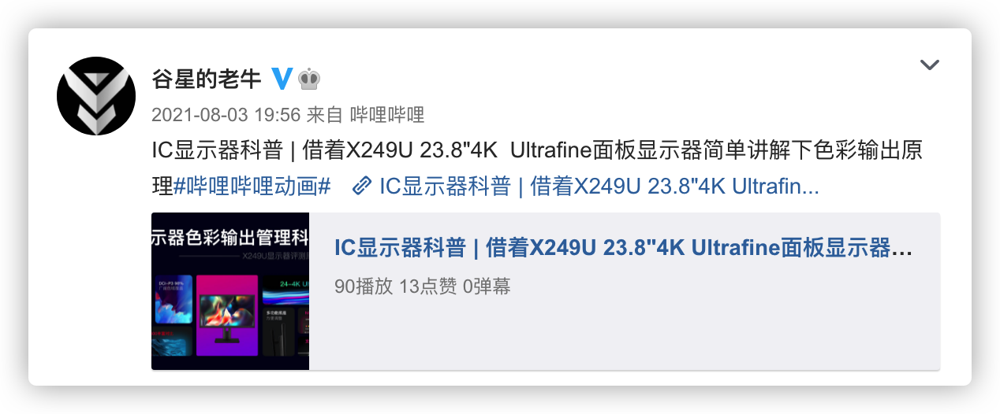
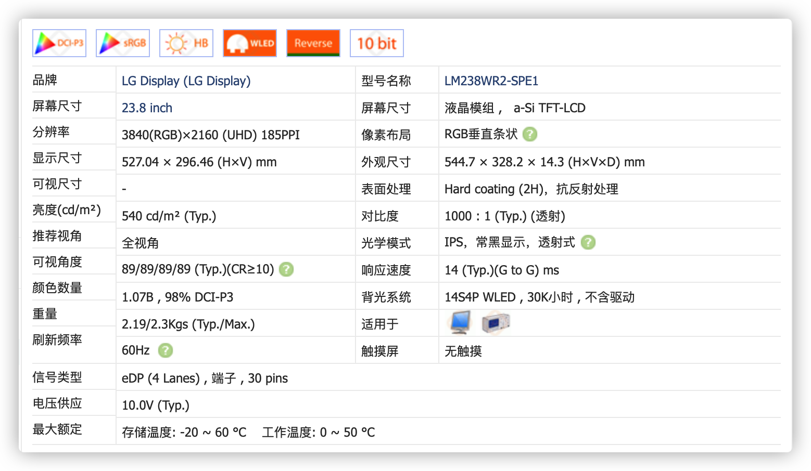
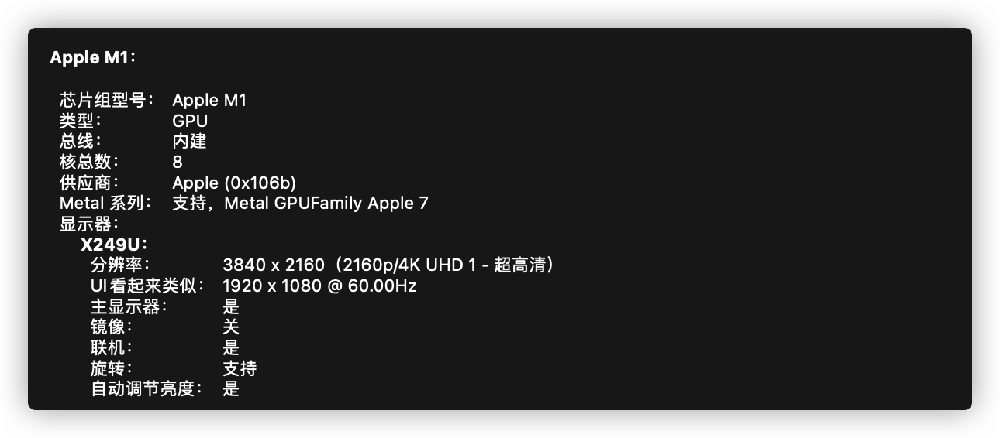
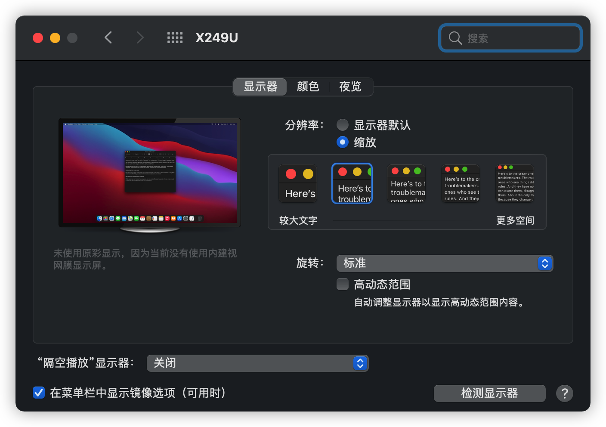
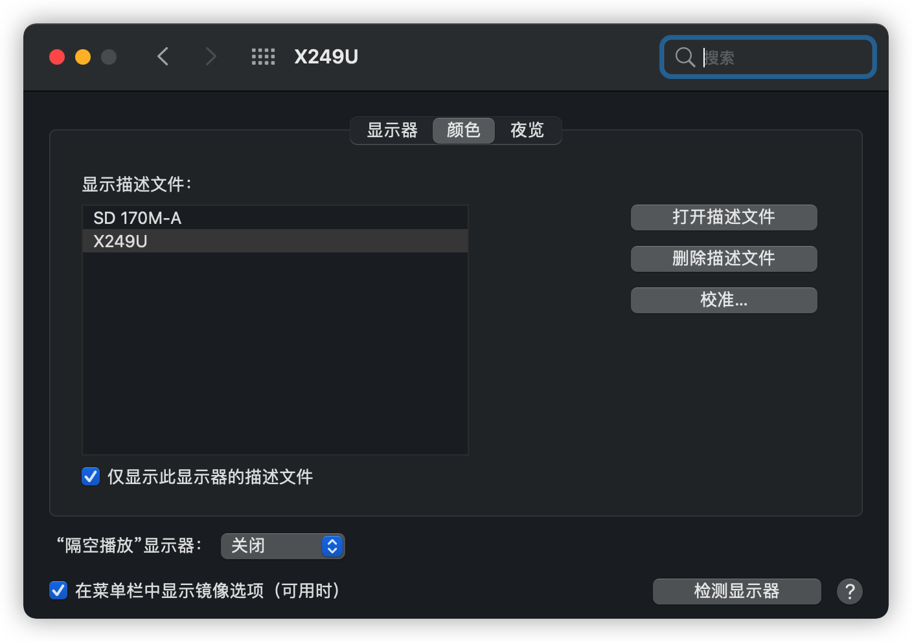

# IC X249U :高性价比的4K HDR Mac显示器

### 起源

自从买了M1 Mac 之后就有使用外置显示器的打算,可惜已经有的优派VX2478-smhd-2 和Acer VG270U 都是2K 显示器,在Mac 下支持均不太理想.找过2K 显示器的Mac 适配教程,发现需要修改系统文件,且对切换显示不方便,遂放弃.后来在微博上看到谷星的老牛发了一个微博,说是这款显示器采用的LG Ultrafine 4K 的同款面板,价格2599,性价比相比于LG Ultrafine 高了很多.于是深入了解了一下.

这款显示面板型号为 **LM238WR2-SPE1**,支持4K HDR600.具体参数如下

支持Mac 一线连.接口有DP1.4,HDMI2.0,Type-C,Audio.Type-C 接口支持65W 一线反冲.

这款显示器随机附赠了一个DP线.不过Mac 上使用多有不便,而之前买的Belkin 的Type-C 扩展坞HDMI接口最大只支持4K 30Hz.于是尝试额外购买全功能Type-C 线使用.最终选择了Coaxial USB4 40Gbps 全功能编制线.这款数据线支持USB4 和雷电3.一步到位防止出现意外.

数据线到位之后,连接后进行测试,第一次插入时发现点亮后只有4K 30Hz.后来将数据线拔下重新插入后恢复4K 60Hz,原因至今不明,可能是接口没插好? 后续再没有出现这样的问题.点亮成功后查看充电功率,发现充电功率有65W.

显示器在Mac 显示信息如下

在显示设置页面显示可以开启HDR以及HiDPi.同时自带了校色文件

