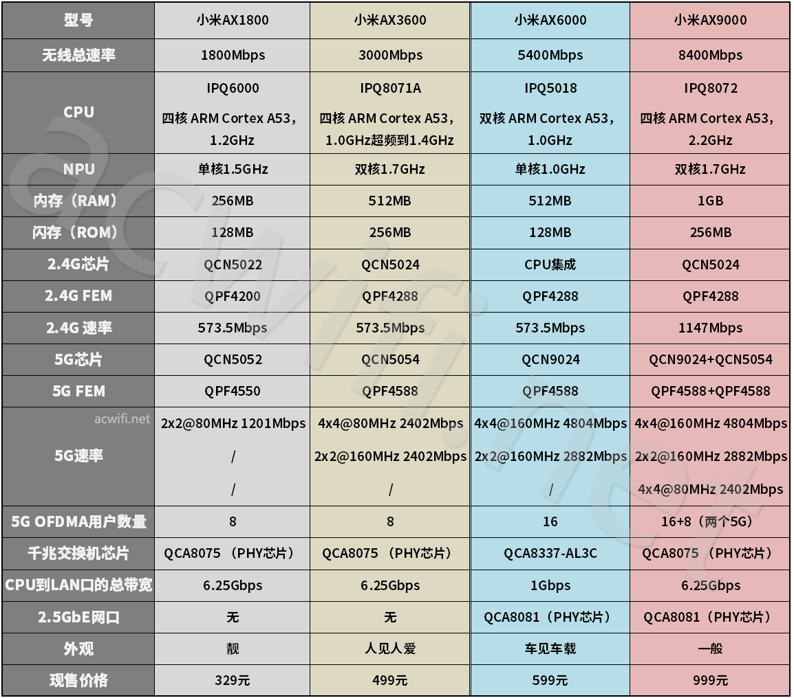
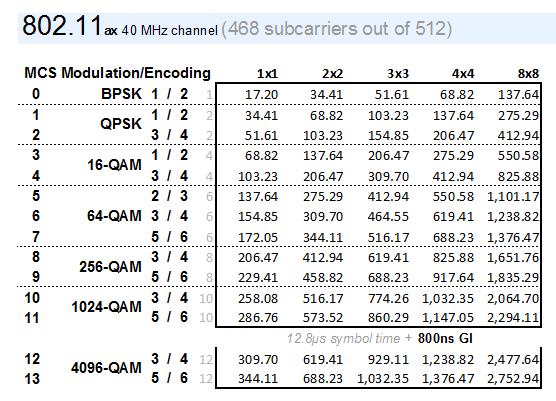
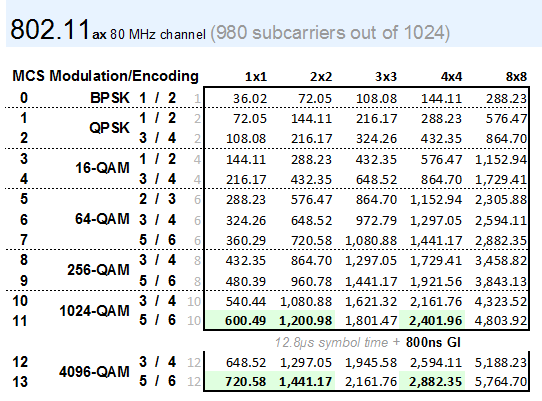
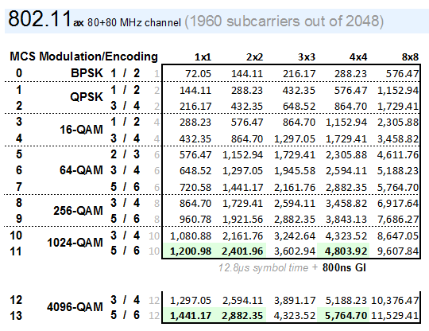

# 计算机网络名词与概念

按照五层网络模型,即物理层、数据链路层、网络层、传输层、和应用层进行描述.

## 特别关注
1.WIFI 6 
想要研究WI-FI 6 的原因是M1 Mac 支持WIFI 6.好奇WIFI 6 到底支持多大的速率,网上宣传最大速率可以达到9.6Gbps,如果真如宣称的那样,那么就可以不用外接万兆网卡了.了解后发现M1 Mac 最高支持2x2 MIMO,在WiFi 6 模式、最高通道带宽为80MHz 下,最高速率为1.2Gbps.

相比20、19、18 款4个 Thunderbolt 3 接口的13 MacBook Pro 以及 16 MacBook Pro 虽然只支持到WiFi 5(802.11ac),但支持3x3 的MIMO.在WiFi5模式下、最高通道为80MHz 下,最高速率为1.3Gbps.

M1 Mac WiFi 6模式下的最高速率反而比WiFi 5 老版 Macbook Pro 要低....
而且还不如NUC8i7BEH 的Intel AC9560 网卡,Intel AC9560 最大支持160MHz 频宽也是2x2 MIMO,最高速率为1.73Gbps,不过....在5GHz频段上，160MHz的信道非常少，中国只有1个。而在中国，这1个信道可能还有一部分是跨越到动态频率选择（DFS）的信道.

M1 Mac 上的WIFI 6 无线网卡型号为苹果 USI 339S00758

https://support.apple.com/zh-cn/guide/deployment-reference-macos/apdd3e47748d/web

WIFI 6 的路由器

在802.11ax模式下的2.4G速率表：（40MHz）

在802.11ax下的5G速率表：（80MHz）

在802.11ax下的5G速率表：（160MHz）

[参考]

1.https://www.acwifi.net/12527.html

## 物理层

- 通信系统模型
- 速率、波特、带宽
- 奈奎斯特定理
- 香农定理
- 编码与调制
- 电路交换
- 报文交换
- 分组交换
- 数据报
- 虚电路
- 双绞线、同轴电缆、光纤与无线传输介质
- 中继器
- 集线器

## 数据链路层

- 链路管理
- 帧定界、帧同步与透明传输
- 流量控制
  - 流量控制
  - 可靠传输
  - 滑动窗口
  - 单帧滑动窗口与停止-等待协议
  - 多帧滑动窗口与后退N帧协议
  - 多帧滑动窗口与选择重传协议
- 差错控制
  - 检错编码
  - 纠错编码
- 组帧的几种方法
- 介质访问控制(Medium Access Control,MAC)
  - 频分多路复用(FDM)
  - 时分多路复用(TDM)
  - 波分多路复用(WDM)
  - 码分多路复用(CDM)
- 随机访问介质控制
  - ALOHA协议
  - CSMA协议
  - CSMA/CD协议
  - CSMA/CA协议
- 轮询访问介质控制:令牌传递协议
- 局域网
- 以太网
- IEEE 802.3
- IEEE 802.11
- 令牌环网原理
- 广域网
- PPP协议
- HDLC协议
- 网桥
- 交换机

## 网络层

- 异构网络互联
- 路由
- 转发
- 拥塞控制
- 路由算法

  - 静态路由
  - 动态路由
  - 距离-向量路由算法
  - 链路状态路由算法
  - 层次路由

- IPv4

  - IPv4 分组
  - IIPv4 数据报分片
  - 网络转发分组流程
  - IPv4 地址
  - 网络地址转换 (NAT)
  - 子网划分
  - 子网掩码
  - 无分类域间路由选择(CIDR)
  - 地址解析协议(ARP)
  - 动态主机配置协议(DHCP)
  - 网际控制报文协议(ICMP)

- IPv6
  - 单播
  - 多播
  - 任播
- 路由协议
  - 自治系统(Autonomous System, AS)
  - 内部网关协议(Interior Gateway Protocol, IGP)
  - 外部网关协议(External Gateway Protocol, EGP)
  - 路由信息协议(Routing Information Protocol, RIP)
  - 开放最短路径优先协议(OSPF)
  - 边界网关协议(Border Gateway Protocol, BGP)

- IP组播
  - 组播地址
  - 因特网网组管理协议(Internet Group Management Protocol,IGMP)
  - 组播路由协议
- 移动IP
- 路由器的组成
- 路由表
- 路由转发

## 传输层

- 端口
- 端口号
- 套接字
- UDP
- UDP校验
- TCP
  - TCP报文段
  - TCP连接管理
  - TCP可靠传输
  - TCP流量控制
  - TCP拥塞控制

## 应用层

- 网络应用模型
  - 客户/服务器模型
  - P2P模型
- 域名系统(DNS)
  - 层次域名空间
  - 域名服务器
  - 域名解析过程
- 文件传输协议(FTP)
  - 工作原理
  - 控制连接
  - 数据连接
- 电子邮件
  - 组成结构
  - 电子邮件格式与MIME
  - SMTP
  - POP3
- 万维网(WWW)
  - 概念与组成结构
  - 超文本传输协议(HTTP)
    - HTTP操作过程
    - HTTP特点
    - HTTP报文结构